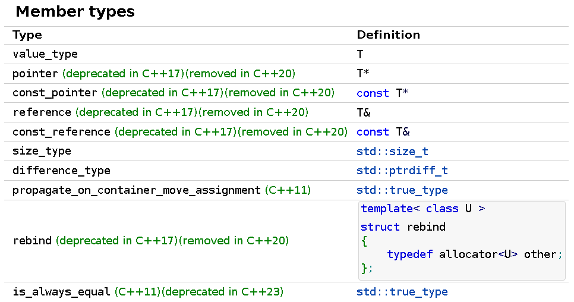
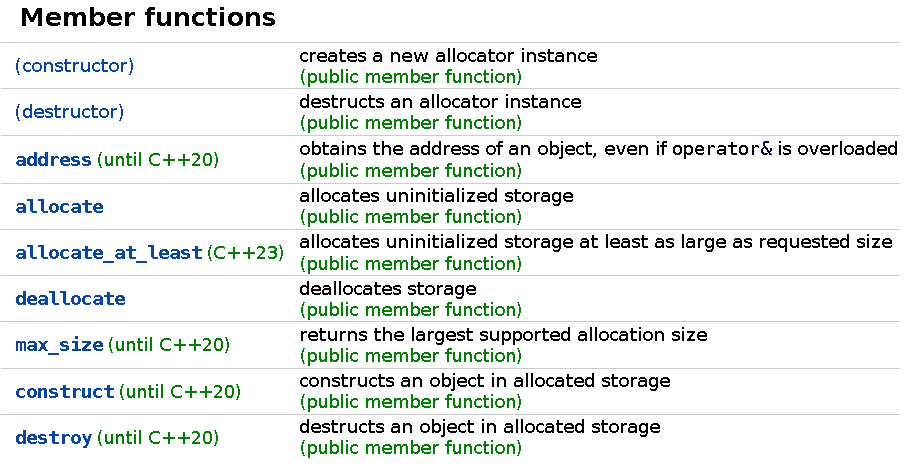

# allocator.h

>文件路径：bits\allocator.h


# 概述

定义了std::allocator。


# 文件头

```c++
/** @file bits/allocator.h
 *  This is an internal header file, included by other library headers.
 *  Do not attempt to use it directly. @headername{memory}
 */

#ifndef _ALLOCATOR_H
#define _ALLOCATOR_H 1

#include <bits/c++allocator.h> // 定义了std::allocator的基类
#include <bits/memoryfwd.h>
#if __cplusplus >= 201103L
#include <type_traits>
#endif
```


# namespace std

在之后的源码剖析中，绝大多数代码都和这里allocator定义在相同命名空间，故提前说明。

```c++
namespace std _GLIBCXX_VISIBILITY(default)
{
    _GLIBCXX_BEGIN_NAMESPACE_VERSION

    template<>
    class allocator<void>
    {
        //...
    };

    template<typename _Tp>
    class allocator : public __allocator_base<_Tp>
    {
        //...
    };

    _GLIBCXX_END_NAMESPACE_VERSION
} // namespace std
```

代码中的_GLIBCXX_BEGIN_NAMESPACE_VERSION和_GLIBCXX_END_NAMESPACE_VERSION是一对宏。定义在bits\c++config文件中：

```c++
namespace __gnu_cxx
{
  inline namespace __7 { }
  namespace __detail { inline namespace __7 { } }
}
# define _GLIBCXX_BEGIN_NAMESPACE_VERSION namespace __7 {
# define _GLIBCXX_END_NAMESPACE_VERSION }
```

能够看到这一对宏代表了一个命名空间：

```c++
namespace __7 { }
```

重点在于namespace __gnu_cxx中定义了inline namespce __7。inline namespace的含义是这个命名空间是内联的，内联命名空间中的名称可以直接使用。比如上面源代码中的allocator

使用标准库提供的内存分配器时可以直接使用std::allocator而不需要指定__7。

在标准库其他源代码中还能经常看到这两个宏。


# std::allocator

## 标准接口






**Notes**

成员模板类提供了一种获取分配不同类型元素的allocator的方法。例如std::list\<T, A\>为内置节点类型分配内存，使用分配器A::rebind\<Node\<T\>\>::other（直到C++11）。


## 定义

```c++
template<typename _Tp>
    class allocator : public __allocator_base<_Tp>
    {
        //...
    };
```

能够看到std::allocator只是定义了部分标准接口，且继承自__allocator_base。更多细节被实现在__allocator_base基类中。\<bits/c++allocator.h\>头文件中指定了std::allocator的基类。

```c++
/** @file bits/c++allocator.h
*  This is an internal header file, included by other library headers.
*  Do not attempt to use it directly. @headername{memory}
*/

#ifndef _GLIBCXX_CXX_ALLOCATOR_H
#define _GLIBCXX_CXX_ALLOCATOR_H 1

#include <ext/new_allocator.h>
 
#if __cplusplus >= 201103L
namespace std
{
  /**
   *  @brief  An alias to the base class for std::allocator.
   *  @ingroup allocators
   *
   *  Used to set the std::allocator base class to
   *  __gnu_cxx::new_allocator.
   *
   *  @tparam  _Tp  Type of allocated object.
    */
   template<typename _Tp>
    using __allocator_base = __gnu_cxx::new_allocator<_Tp>;
}
#else
// Define new_allocator as the base class to std::allocator.
# define __allocator_base  __gnu_cxx::new_allocator
#endif

#endif
```

这里指明了std::allocator继承自[new_allocator](new_allocator.html)。也就是底层借助new_allocator完成内存分配，被定义在ext/new_allocator.h中。实际上GNU中定义了许多不同类型的allocator，在ext目录下能够看到其他不同类型的allocator。


## 成员类型

```c++
public:
    typedef size_t     size_type;
    typedef ptrdiff_t  difference_type;
    typedef _Tp* pointer;
    typedef const _Tp* const_pointer;
    typedef _Tp& reference;
    typedef const _Tp& const_reference;
    typedef _Tp        value_type;

    template<typename _Tp1>
    struct rebind
    {
        typedef allocator<_Tp1> other;
    };

#if __cplusplus >= 201103L
    // _GLIBCXX_RESOLVE_LIB_DEFECTS
    // 2103. std::allocator propagate_on_container_move_assignment
    typedef true_type propagate_on_container_move_assignment;
#endif
```

其中rebind成员又是一个模板类，用于获得和当前allocator类型一致，元素类型为_Tp1的分配器类型。

注意到在C++11版本之后allocator定义了propagate_on_container_move_assignment类型。这与容器的移动赋值运算符相关。propagate_on_container_move_assignment为true_type的含义大概是当我们对allocator进行移动赋值时直接使用rhs替换lhs。否则就会拷贝一份。具体关于这点的分析可以见vector中拷贝和赋值运算符。而true_type/false_type见type_traits。


## 构造/析构函数


```c++
public:
    allocator() throw() { }  //默认构造，throw()指示函数不会抛出异常

    allocator(const allocator& __a) throw()  //拷贝构造
        : __allocator_base<_Tp>(__a) { }

    template<typename _Tp1>
    allocator(const allocator<_Tp1>&) throw() { }

    ~allocator() throw() { }  //析构
```

由于allocator没有数据成员，因此构造析构函数函数体内不需要做任何事。

## operator==、operator!=（非成员接口）

```c++
template<typename _T1, typename _T2>
inline bool
    operator==(const allocator<_T1>&, const allocator<_T2>&)
{
    return true;
}

template<typename _Tp>
inline bool
    operator==(const allocator<_Tp>&, const allocator<_Tp>&)
{
    return true;
}

template<typename _T1, typename _T2>
inline bool
    operator!=(const allocator<_T1>&, const allocator<_T2>&)
{
    return false;
}

template<typename _Tp>
inline bool
    operator!=(const allocator<_Tp>&, const allocator<_Tp>&)
{
    return false;
}
```

同样，由于allocator没有任何数据成员，因此相等比较运算符永远为true，不相等比较运算符永远为false。


## 特化版本

```c++
/// allocator<void>特化版本
    template<>
class allocator<void>
{
public:
    typedef size_t      size_type;
    typedef ptrdiff_t   difference_type;
    typedef void* pointer;
    typedef const void* const_pointer;
    typedef void        value_type;

    template<typename _Tp1>
    struct rebind
    {
        typedef allocator<_Tp1> other;
    };

#if __cplusplus >= 201103L
    // _GLIBCXX_RESOLVE_LIB_DEFECTS
    // 2103. std::allocator propagate_on_container_move_assignment
    typedef true_type propagate_on_container_move_assignment;
#endif
};
```

这是allocator\<void\>特化版本

# 源代码

```c++
/** @file bits/allocator.h
 *  This is an internal header file, included by other library headers.
 *  Do not attempt to use it directly. @headername{memory}
 */

#ifndef _ALLOCATOR_H
#define _ALLOCATOR_H 1

#include <bits/c++allocator.h> // Define the base class to std::allocator.
#include <bits/memoryfwd.h>
#if __cplusplus >= 201103L
#include <type_traits>
#endif

namespace std _GLIBCXX_VISIBILITY(default)
{
    _GLIBCXX_BEGIN_NAMESPACE_VERSION

        /**
         *  @addtogroup allocators
         *  @{
         */

         /// allocator<void> specialization.
        template<>
    class allocator<void>
    {
    public:
        typedef size_t      size_type;
        typedef ptrdiff_t   difference_type;
        typedef void* pointer;
        typedef const void* const_pointer;
        typedef void        value_type;

        template<typename _Tp1>
        struct rebind
        {
            typedef allocator<_Tp1> other;
        };

#if __cplusplus >= 201103L
        // _GLIBCXX_RESOLVE_LIB_DEFECTS
        // 2103. std::allocator propagate_on_container_move_assignment
        typedef true_type propagate_on_container_move_assignment;
#endif
    };

    /**
     * @brief  The @a standard allocator, as per [20.4].
     *
     *  See http://gcc.gnu.org/onlinedocs/libstdc++/manual/bk01pt04ch11.html
     *  for further details.
     *
     *  @tparam  _Tp  Type of allocated object.
     */
    template<typename _Tp>
    class allocator : public __allocator_base<_Tp>
    {
    public:
        typedef size_t     size_type;
        typedef ptrdiff_t  difference_type;
        typedef _Tp* pointer;
        typedef const _Tp* const_pointer;
        typedef _Tp& reference;
        typedef const _Tp& const_reference;
        typedef _Tp        value_type;

        template<typename _Tp1>
        struct rebind
        {
            typedef allocator<_Tp1> other;
        };

#if __cplusplus >= 201103L
        // _GLIBCXX_RESOLVE_LIB_DEFECTS
        // 2103. std::allocator propagate_on_container_move_assignment
        typedef true_type propagate_on_container_move_assignment;
#endif

        allocator() throw() { }

        allocator(const allocator& __a) throw()
            : __allocator_base<_Tp>(__a) { }

        template<typename _Tp1>
        allocator(const allocator<_Tp1>&) throw() { }

        ~allocator() throw() { }

        // Inherit everything else.
    };

    template<typename _T1, typename _T2>
    inline bool
        operator==(const allocator<_T1>&, const allocator<_T2>&)
    {
        return true;
    }

    template<typename _Tp>
    inline bool
        operator==(const allocator<_Tp>&, const allocator<_Tp>&)
    {
        return true;
    }

    template<typename _T1, typename _T2>
    inline bool
        operator!=(const allocator<_T1>&, const allocator<_T2>&)
    {
        return false;
    }

    template<typename _Tp>
    inline bool
        operator!=(const allocator<_Tp>&, const allocator<_Tp>&)
    {
        return false;
    }

    /// @} group allocator

    // Inhibit implicit instantiations for required instantiations,
    // which are defined via explicit instantiations elsewhere.
#if _GLIBCXX_EXTERN_TEMPLATE
    extern template class allocator<char>;
    extern template class allocator<wchar_t>;
#endif

    // Undefine.
#undef __allocator_base

  // To implement Option 3 of DR 431.
    template<typename _Alloc, bool = __is_empty(_Alloc)>
    struct __alloc_swap
    {
        static void _S_do_it(_Alloc&, _Alloc&) _GLIBCXX_NOEXCEPT { }
    };

    template<typename _Alloc>
    struct __alloc_swap<_Alloc, false>
    {
        static void
            _S_do_it(_Alloc& __one, _Alloc& __two) _GLIBCXX_NOEXCEPT
        {
            // Precondition: swappable allocators.
            if (__one != __two)
                swap(__one, __two);
        }
    };

    // Optimize for stateless allocators.
    template<typename _Alloc, bool = __is_empty(_Alloc)>
    struct __alloc_neq
    {
        static bool
            _S_do_it(const _Alloc&, const _Alloc&)
        {
            return false;
        }
    };

    template<typename _Alloc>
    struct __alloc_neq<_Alloc, false>
    {
        static bool
            _S_do_it(const _Alloc& __one, const _Alloc& __two)
        {
            return __one != __two;
        }
    };

#if __cplusplus >= 201103L
    template<typename _Tp, bool
        = __or_<is_copy_constructible<typename _Tp::value_type>,
        is_nothrow_move_constructible<typename _Tp::value_type>>::value>
        struct __shrink_to_fit_aux
    {
        static bool _S_do_it(_Tp&) noexcept { return false; }
    };

    template<typename _Tp>
    struct __shrink_to_fit_aux<_Tp, true>
    {
        static bool
            _S_do_it(_Tp& __c) noexcept
        {
            __try
            {
                _Tp(__make_move_if_noexcept_iterator(__c.begin()),
                    __make_move_if_noexcept_iterator(__c.end()),
                    __c.get_allocator()).swap(__c);
                return true;
            }
            __catch(...)
            {
                return false;
            }
        }
    };
#endif

    _GLIBCXX_END_NAMESPACE_VERSION
} // namespace std

#endif
```