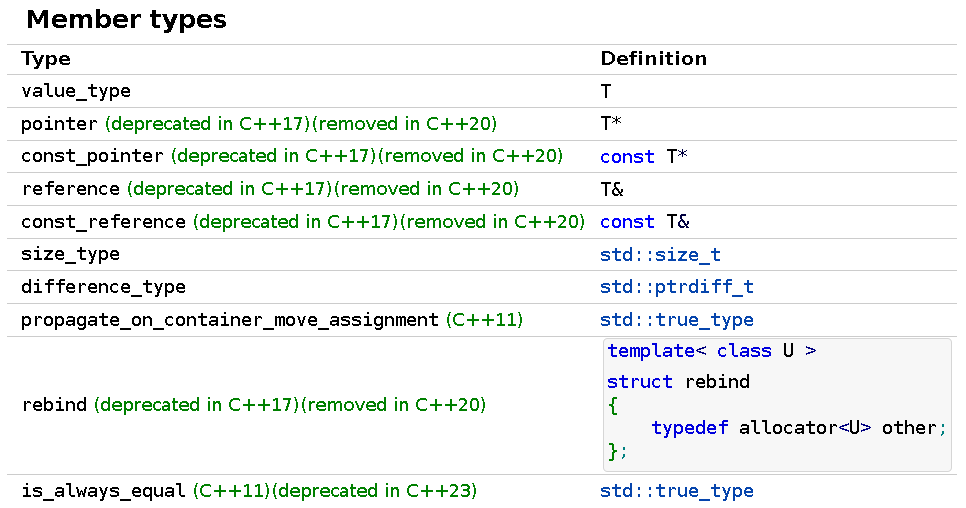
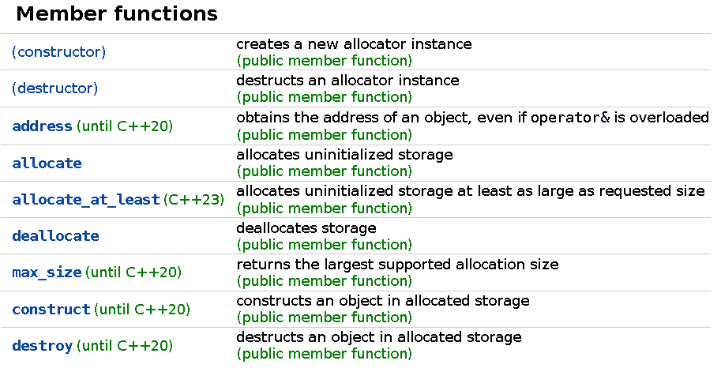
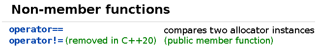

# new_allocator.h

>文件路径：ext\new_allocator.h

## 接口

>接口详情见：[cppreference](https://en.cppreference.com/)







**Notes**

成员模板类提供了一种获取分配不同类型元素的allocator的方法。例如std::list\<T, A\>为内置节点类型分配内存，使用分配器A::rebind\<Node\<T\>\>::other（直到C++11）。


## 代码分解——new_allocator

### 说明

new_allocator是CNU标准库的默认内存分配器，std::allocator就是封装后的new_allocator


### define

```c++
template<typename _Tp>
class new_allocator
{
    //...
};
```

### Member types

```c++
//public
typedef size_t     size_type;
typedef ptrdiff_t  difference_type;
typedef _Tp* pointer;
typedef const _Tp* const_pointer;
typedef _Tp& reference;
typedef const _Tp& const_reference;
typedef _Tp        value_type;

template<typename _Tp1>
struct rebind
{
    typedef new_allocator<_Tp1> other;
};

#if __cplusplus >= 201103L
    // _GLIBCXX_RESOLVE_LIB_DEFECTS
    // 2103. propagate_on_container_move_assignment
    typedef std::true_type propagate_on_container_move_assignment;
#endif
```

数据成员和C++标准接口完全一致。


### Member functions

**ctor与big five**

```c++
//public
new_allocator() _GLIBCXX_USE_NOEXCEPT { }

new_allocator(const new_allocator&) _GLIBCXX_USE_NOEXCEPT { }

template<typename _Tp1>
new_allocator(const new_allocator<_Tp1>&) _GLIBCXX_USE_NOEXCEPT { }

~new_allocator() _GLIBCXX_USE_NOEXCEPT { }
```

std::allocator中实际上并没有数据成员，因此其默认构造和拷贝构造以及析构函数全部都是空实现。注意其中还有一个模板形式的拷贝构造函数，使用value_type不同的另一个allocator构造新的allocator。

注意这个构造函数模板，它使用一个可能分配不同元素类型的分配器来构造自身。这个函数有什么用呢？实际上它允许这样的事发生：

```c++
std::allocator<int> alloc = std::allocator<long long>();
```

即，将一个元素类型为long long的分配器变成元素类型为int的分配器。这意味着如果一个函数接受allocator<int>类型的分配器，不论传递给这个函数什么元素类型的分配器，结果都是一样的。

**address**

```c++
//public
pointer
    address(reference __x) const _GLIBCXX_NOEXCEPT
{
    return std::__addressof(__x);
}

const_pointer
    address(const_reference __x) const _GLIBCXX_NOEXCEPT
{
    return std::__addressof(__x);
}
```

address实现两个重载版本分别用于获取常量对象和非常量对象的地址。对象地址获取不改变allocator状态，因此为常量成员函数。

_GLIBCXX_NOEXCEPT被定义在bits/c++config中，指明该函数不会抛出异常：
```c++
// Macro for noexcept, to support in mixed 03/0x mode.
#ifndef _GLIBCXX_NOEXCEPT
# if __cplusplus >= 201103L
#  define _GLIBCXX_NOEXCEPT noexcept
#  define _GLIBCXX_USE_NOEXCEPT noexcept
#  define _GLIBCXX_THROW(_EXC)
# else
#  define _GLIBCXX_NOEXCEPT
#  define _GLIBCXX_USE_NOEXCEPT throw()
#  define _GLIBCXX_THROW(_EXC) throw(_EXC)
# endif
#endif
```

对于noexcept多数情况下被用于构造、拷贝、移动、交换等函数上。其他函数一般不会特地考虑是否会抛出异常。

另外看到address函数只是调用了std::__addressof。这个函数位于bits/move.h下：

```c++
template<typename _Tp>
inline _Tp*
__addressof(_Tp& __r) _GLIBCXX_NOEXCEPT
{
    return reinterpret_cast<_Tp*>
        (&const_cast<char&>(reinterpret_cast<const volatile char&>(__r)));
}
```

首先之所以不直接通过&运算符获得对象地址是因为对象可能对其进行重载。__addressof中对__r进行三次类型转换操作：
- reinterpret_cast\<const volatile char&\>，将__r转为char&是为了防止__r对&运算符重载，但对char使用&是没有问题的。而增加const和volatile修饰符是因为无法对没有const和volatile修饰的对象使用reinterpret_cast去除const和volatile属性，因此无论__r有没有const和volatile属性，干脆直接加上。
- &const_cast\<char&\>，去除了__r的const和volatile属性，同时最前面的&运算符获得对象地址。
- reinterpret_cast<_Tp*>，将得到的char*类型目标地址转换为真正的目标类型地址_Tp\*。

在bits/move.h文件下还定义了std::addressof：

```c++
template<typename _Tp>
inline _Tp*
addressof(_Tp& __r) noexcept
{
    return std::__addressof(__r);
}
```

**allocate和deallocate**

```c++
//public
// NB: __n is permitted to be 0.  The C++ standard says nothing
// about what the return value is when __n == 0.
pointer
    allocate(size_type __n, const void* = 0)
{
    if (__n > this->max_size())
        std::__throw_bad_alloc();

    return static_cast<_Tp*>(::operator new(__n * sizeof(_Tp)));
}

// __p is not permitted to be a null pointer.
void
    deallocate(pointer __p, size_type)
{
    ::operator delete(__p);
}
```

可以看到std默认分配器allocate和deallocate函数没有做任何操作，只是简单的封装了::operator new和::operator delete。

allocate中对分配内存大小__n判断，如果大于max_size()就抛出std::__throw_bad_alloc()异常。这个异常被定义在gcc-4.9.0/libstdc++-v3/src/c++11/functexcept.cc中：

```c++
void
__throw_bad_alloc()
{
    _GLIBCXX_THROW_OR_ABORT(bad_alloc());
}
```

_GLIBCXX_THROW_OR_ABORT定义在bits/c++config中：

```c++
#ifndef _GLIBCXX_THROW_OR_ABORT
# if __EXCEPTIONS
#  define _GLIBCXX_THROW_OR_ABORT(_EXC) (throw (_EXC))
# else
#  define _GLIBCXX_THROW_OR_ABORT(_EXC) (__builtin_abort())
# endif
#endif
```

因此std::__throw_bad_alloc()实际上只是简单的抛出bat_alloc异常。

**max_size**

```c++
//public
size_type
    max_size() const _GLIBCXX_USE_NOEXCEPT
{
    return size_t(-1) / sizeof(_Tp);
}
```

**construct和destroy**

```c++
//public
#if __cplusplus >= 201103L
    template<typename _Up, typename... _Args>
    void
        construct(_Up* __p, _Args&&... __args)
    {
        ::new((void*)__p) _Up(std::forward<_Args>(__args)...);
    }

    template<typename _Up>
    void
        destroy(_Up* __p) { __p->~_Up(); }
#else
    // _GLIBCXX_RESOLVE_LIB_DEFECTS
    // 402. wrong new expression in [some_] allocator::construct
    void
        construct(pointer __p, const _Tp& __val)
    {
        ::new((void*)__p) _Tp(__val);
    }

    void
        destroy(pointer __p) { __p->~_Tp(); }
#endif
```

construct通过placement new在__p指向地址构造对象，实际上就是在指定地址上调用对象构造函数。destroy通过对象析构函数销毁对象。

另外在C++11之后引入了可变参数模板以及移动语义，从C++11版本后的construct函数实现得到体现。注意C++11版本后construct和destroy函数构造和销毁的类型并不要求是_Tp类型。这对于new_allocator似乎是合理的。因为construct和destroy只是使用对象的构造和析构函数在指定内存地址上创建和销毁对象，至于对象具体是哪种类型并不重要。

另外在construct中使用到了C++11中新特性variadic templates，这里稍作解释。其使用方法沿用了C语言中ellipsis（...），这个符号被用在了三个地方。
- 模板参数中使用：typename... _Args。这里...表示含义是template parameters pack，表示这里有多种type。
- 函数参数列表中使用：_Args&&... __args。这里...表示含义是function parameters pack，表示这里有多个参数。
- 函数调用中使用：std::forward<_Args>(__args)...。这是pack expansion，将参数名称展开为参数列表。注意这里写法和其他地方稍有不同。如下面示例代码中解释的那样。这里的std::forward<_Args>(__args)...实际上表示的是对展开后的__args分别调用forward函数。

```
functions(params...) ===>
functions(param1, param2, ..., paramN)

functions(std::forward<Tys>(params)...) ===>
functions(std::forward<Ty1>(param1), std::forward<Ty2>(param2), ..., std::forward<TyN>(paramN))
```

下面我们再举一个例子来使用一下上面这些可变类型、可变参数。这个例子只是将不定数量和类型的数值乘2之后输出：

```c++
//doubleVal将任意数字类型值翻倍
template<typename T>
T doubleVal(T val){
    return val*2;
}

// printVal输出不定参数及个数的数字
template<typename T>
void printVal(T val){
    cout << val << endl;
}

template<typename T, typename... Args>
void printVal(T val, Args ...args){
    cout << val << "  ";
    printVal(args...);
}

//doubleAndPrintVal将不定参数及个数的数字翻倍并输出
template<typename... Args>
void doubleAndPrintVal(Args... args){
    printVal(doubleVal(args)...);
}

int main(){
    doubleAndPrintVal(1, 2.3, 4, -6.2);  //输出: 2  4.6  8  -12.4
    return 0;
}
```

### Non-Member functions

**operator==和operator!=**

```c++
template<typename _Tp>
inline bool
    operator==(const new_allocator<_Tp>&, const new_allocator<_Tp>&)
{
    return true;
}

template<typename _Tp>
inline bool
    operator!=(const new_allocator<_Tp>&, const new_allocator<_Tp>&)
{
    return false;
}
```

因为allocator本身没有任何数据成员，因此operator==总是返回true，operator!=总是返回false

我们上面看到new_allocator本身是支持不同类型转换的，如可以将new_allocator\<long long\>转换为new_allocator\<int\>等。但是这里比较运算符却只能比较两个相同类型的new_allocator，事实上对于new_allocator这样的无类型allocator来讲，不论是分配int还是分配long long都没有区别。因此ew_allocator\<long long\>和new_allocator\<int\>应该也可以比较并且应该相等才对。事实上这里确实可以写上对于不同类型的比较运算符，但是由于new_allocator是内部分配器，因此这些操作被放在了std::allocator中。


## 源代码

```c++
/** @file ext/new_allocator.h
 *  This file is a GNU extension to the Standard C++ Library.
 */

#ifndef _NEW_ALLOCATOR_H
#define _NEW_ALLOCATOR_H 1

#include <bits/c++config.h>
#include <new>
#include <bits/functexcept.h>
#include <bits/move.h>
#if __cplusplus >= 201103L
#include <type_traits>
#endif

namespace __gnu_cxx _GLIBCXX_VISIBILITY(default)
{
    _GLIBCXX_BEGIN_NAMESPACE_VERSION

    using std::size_t;
    using std::ptrdiff_t;

    /**
     *  @brief  使用global new的allocator， as per [20.4].
     *  @ingroup allocators
     *
     *  这正是C++标准中定义的分配器
     *    - 所有allocations调用operator new
     *    - 所有deallocations调用operator delete
     *
     *  @tparam  _Tp  被分配的对象类型
     */
    template<typename _Tp>
    class new_allocator
    {
    public:

        //Member types
        typedef size_t     size_type;
        typedef ptrdiff_t  difference_type;
        typedef _Tp* pointer;
        typedef const _Tp* const_pointer;
        typedef _Tp& reference;
        typedef const _Tp& const_reference;
        typedef _Tp        value_type;

        template<typename _Tp1>
        struct rebind
        {
            typedef new_allocator<_Tp1> other;
        };

#if __cplusplus >= 201103L
        // _GLIBCXX_RESOLVE_LIB_DEFECTS
        // 2103. propagate_on_container_move_assignment
        typedef std::true_type propagate_on_container_move_assignment;
#endif
        //Member functions
        new_allocator() _GLIBCXX_USE_NOEXCEPT { }

        new_allocator(const new_allocator&) _GLIBCXX_USE_NOEXCEPT { }

        template<typename _Tp1>
        new_allocator(const new_allocator<_Tp1>&) _GLIBCXX_USE_NOEXCEPT { }

        ~new_allocator() _GLIBCXX_USE_NOEXCEPT { }

        pointer
            address(reference __x) const _GLIBCXX_NOEXCEPT
        {
            return std::__addressof(__x);
        }

        const_pointer
            address(const_reference __x) const _GLIBCXX_NOEXCEPT
        {
            return std::__addressof(__x);
        }

        // NB: __n is permitted to be 0.  The C++ standard says nothing
        // about what the return value is when __n == 0.
        pointer
            allocate(size_type __n, const void* = 0)
        {
            if (__n > this->max_size())
                std::__throw_bad_alloc();

            return static_cast<_Tp*>(::operator new(__n * sizeof(_Tp)));
        }

        // __p is not permitted to be a null pointer.
        void
            deallocate(pointer __p, size_type)
        {
            ::operator delete(__p);
        }

        size_type
            max_size() const _GLIBCXX_USE_NOEXCEPT
        {
            return size_t(-1) / sizeof(_Tp);
        }

#if __cplusplus >= 201103L
        template<typename _Up, typename... _Args>
        void
            construct(_Up* __p, _Args&&... __args)
        {
            ::new((void*)__p) _Up(std::forward<_Args>(__args)...);
        }

        template<typename _Up>
        void
            destroy(_Up* __p) { __p->~_Up(); }
#else
        // _GLIBCXX_RESOLVE_LIB_DEFECTS
        // 402. wrong new expression in [some_] allocator::construct
        void
            construct(pointer __p, const _Tp& __val)
        {
            ::new((void*)__p) _Tp(__val);
        }

        void
            destroy(pointer __p) { __p->~_Tp(); }
#endif
    };

    template<typename _Tp>
    inline bool
        operator==(const new_allocator<_Tp>&, const new_allocator<_Tp>&)
    {
        return true;
    }

    template<typename _Tp>
    inline bool
        operator!=(const new_allocator<_Tp>&, const new_allocator<_Tp>&)
    {
        return false;
    }

    _GLIBCXX_END_NAMESPACE_VERSION
} // namespace

#endif
```


