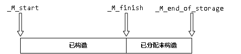
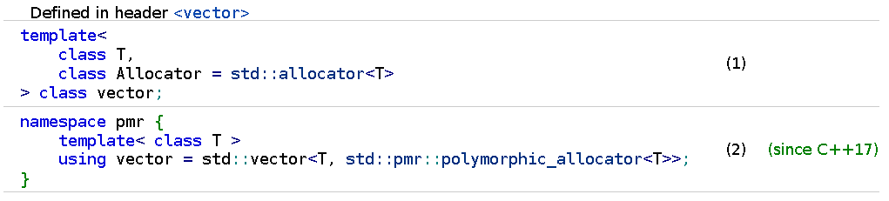
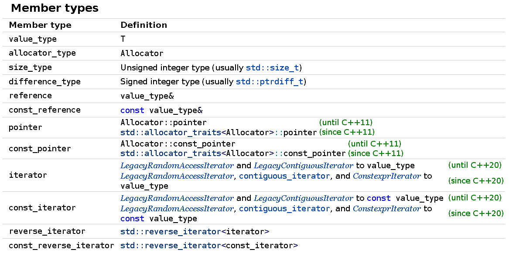
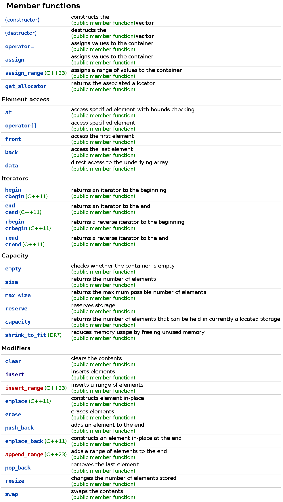
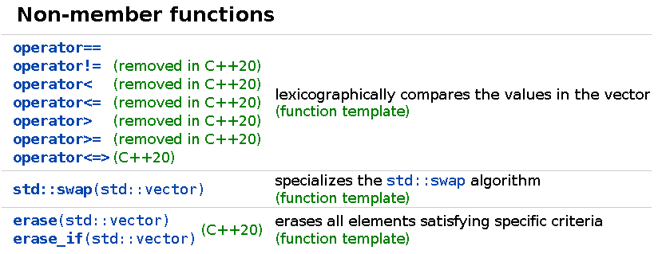

# stl_vector.h

>文件路径：bits/stl_vector.h


# 概述

文件定义了template class _Vector_base和std::vector，其中_Vector_base作为vector基类。_Vector_base将vector中内存分配和释放操作单独封装。

需要注意的是vector中三个用于内存管理的指针成员也全部定义在_Vector_base中。

同样的，在下面源代码解析中，我们主要以C++11之后的版本为主，忽略C++11之前版本的实现。


# _Vector_base

这是vector的基类，主要用于内存分配和释放。其中包含类成员struct _Vector_impl，_Vector_impl中定义了vector用于内存管理的三个指针。

源代码中解释这样做的目的是为了使异常安全更加容易，这个类中没有任何东西构造或析构实际的元素，元素构造和析构由vector自身处理。因此在vector中如果构造和析构出现异常，那么只需要对应处理即可。

另外_Vector_base被vector保护（protected）继承，这可以看成一种变相的组合。我们不一定必须使用继承方式将_Vector_base嵌入vector。

## define

```c++
template<typename _Tp, typename _Alloc>
struct _Vector_base
{
    //...
};
```

## 类型成员

```c++
public:
    typedef typename __gnu_cxx::__alloc_traits<_Alloc>::template
                rebind<_Tp>::other _Tp_alloc_type;
    typedef typename __gnu_cxx::__alloc_traits<_Tp_alloc_type>::pointer
        pointer;
```

使用__alloc_traits得到一个使用_Alloc为分配器类型，_Tp为元素类型的分配器类型_Tp_alloc_type。

使用__alloc_traits得到_Tp_alloc_type分配器的分配元素指针类型pointer。

我们需要注意如果在实例化_Vector_base的过程中_Alloc分配器的元素类型和_Tp不匹配会怎么样。实际上这里_Tp_alloc_type在一定程度上为我们规避了一些错误。直观上我们指定了_Tp，那么我们就是要以_Tp为元素构建vector，因此我们的分配器的元素类型也应该时_Tp。

## struct _Vector_impl

```c++
public:
    struct _Vector_impl
        : public _Tp_alloc_type
    {
        pointer _M_start;
        pointer _M_finish;
        pointer _M_end_of_storage;

        _Vector_impl()
            : _Tp_alloc_type(), _M_start(0), _M_finish(0), _M_end_of_storage(0)
        { }

        _Vector_impl(_Tp_alloc_type const& __a) _GLIBCXX_NOEXCEPT
            : _Tp_alloc_type(__a), _M_start(0), _M_finish(0), _M_end_of_storage(0)
        { }

    #if __cplusplus >= 201103L
        _Vector_impl(_Tp_alloc_type&& __a) noexcept
            : _Tp_alloc_type(std::move(__a)),
            _M_start(0), _M_finish(0), _M_end_of_storage(0)
        { }
    #endif

        void _M_swap_data(_Vector_impl& __x) _GLIBCXX_NOEXCEPT
        {
            std::swap(_M_start, __x._M_start);
            std::swap(_M_finish, __x._M_finish);
            std::swap(_M_end_of_storage, __x._M_end_of_storage);
        }
    };

_Vector_impl _M_impl;
```

_Vector_impl继承自_Tp_alloc_type，所以_Vector_impl也是一个内存分配器，其中只定义了构造函数用于初始化三个数据成员。这三个数据成员也是vector的三个主要数据成员（三个指针）。它们的含义如图：



另外_Vector_base中定义了一个_Vector_impl类型对象_M_impl


## 获取_M_impl

```c++
public:

    typedef _Alloc allocator_type;

    _Tp_alloc_type&
        _M_get_Tp_allocator() _GLIBCXX_NOEXCEPT
    {
        return *static_cast<_Tp_alloc_type*>(&this->_M_impl);
    }

    const _Tp_alloc_type&
        _M_get_Tp_allocator() const _GLIBCXX_NOEXCEPT
    {
        return *static_cast<const _Tp_alloc_type*>(&this->_M_impl);
    }

    allocator_type
        get_allocator() const _GLIBCXX_NOEXCEPT
    {
        return allocator_type(_M_get_Tp_allocator());
    }
```


上面这组函数用于获取_M_impl。_M_get_Tp_allocator有两个重载版本分别用于常量和非常量两种情况。但是注意我们get_allocator是常量成员函数，这意味着其中调用的_M_get_Tp_allocator也总是调用常量版本。

>批注：注意_M_get_Tp_allocator中这个将_M_impl转为常量指针再转为常量对象的写法。

_Alloc被重命名为allocator_type，这和_Tp_alloc_type是有区别的。_Tp_alloc_type是与_Alloc分配器相同，分配元素为_Tp的分配器类型。而_Alloc并不一定分配元素类型为_Tp，可能为其他类型。默认情况下_Alloc为std::allocator<_Tp>，即与_Tp_alloc_type类型相同。

>批注：个人理解_Tp_alloc_type应该是我们在实现vector时的正确类型，但是对外接口仍然使用_Alloc，这也是为什么get_allocator返回的是allocator_type（即_Alloc）。

_M_impl作为_Vector_base的唯一数据成员，_Vector_base主要操作都是围绕_M_impl展开的。

>批注：补充一些关于_Vector_impl和_Vector_base的关系。_Vector_impl实际上指代容器的底层分配器实例，其只是一个分配器类型而已。而_Vector_base指代的是一块由_Vector_impl分配器分配的内存空间，因此它由_M_impl成员来管理这些内存。这一点对下面理解_Vector_base的构造函数很重要

## 构造析构函数

```c++
public:
    _Vector_base()
        : _M_impl() { }

    _Vector_base(const allocator_type& __a) _GLIBCXX_NOEXCEPT
        : _M_impl(__a) { }

    _Vector_base(size_t __n)
        : _M_impl()
    {
        _M_create_storage(__n);
    }

    _Vector_base(size_t __n, const allocator_type& __a)
        : _M_impl(__a)
    {
        _M_create_storage(__n);
    }

    #if __cplusplus >= 201103L
    _Vector_base(_Tp_alloc_type&& __a) noexcept
        : _M_impl(std::move(__a)) { }

    _Vector_base(_Vector_base&& __x) noexcept
        : _M_impl(std::move(__x._M_get_Tp_allocator()))
    {
        this->_M_impl._M_swap_data(__x._M_impl);
    }

    _Vector_base(_Vector_base&& __x, const allocator_type& __a)
        : _M_impl(__a)
    {
        if (__x.get_allocator() == __a)
            this->_M_impl._M_swap_data(__x._M_impl);
        else
        {
            size_t __n = __x._M_impl._M_finish - __x._M_impl._M_start;
            _M_create_storage(__n);
        }
    }
    #endif

    ~_Vector_base() _GLIBCXX_NOEXCEPT
    {
        _M_deallocate(this->_M_impl._M_start, this->_M_impl._M_end_of_storage
            - this->_M_impl._M_start);
    }
```

另外注意到这些构造函数中使用allocator_type类型的分配器来初始化_M_impl。这意味着allocator_type和_Tp_alloc_type应该能够互相转换。如果我们使用的是默认分配器std::allocator，这并不是问题。因为std::allocator使用::operator new和::operator delete分配和释放内存，这与分配器分配元素具体是哪种类型无关。另外使用不同元素类型初始化的std::allocator类型确实可以互相转换。

然后我们来观察一下这一组构造函数。

首先提供了参数类型为分配元素数量以及分配器的普通构造函数，因为vector构造函数中可以提供元素数量和分配器，这与vector构造函数一一对应。

其次提供了移动构造函数，这与vector的移动构造函数同样一一对应，_Vector_base的移动构造函数直接接管了给定的_Vector_base对象，即将_M_impl的取值移动到自己身上。这一操作隐形中将提供的_Vector_base对象内存中元素也一起移动过来。因此对于vector的移动函数，实际上只用调用_Vector_base的移动函数就完成了全部操作。

然后我们看一下移动构造函数另一版本，还额外提供了分配器实例__a。提供allocator_type意味着我们要将当前的_Vector_base分配器设置为__a。但是内存空间呢，要和__x一致。于是我们应该使用__a来构建和__x一样大小的内存空间。但是如果__x分配器和__a相同，那么我们直接swap即可。

最后要注意_Vector_base没有拷贝构造函数，因为对于vector的拷贝构造总是需要将原容器的元素拷贝一份到新的内存中。而元素构建是vector的工作，不是_Vector_base的工作。


下面是用于内存分配和释放的_M_allocate、_M_deallocate。它们只是对_alloc_traits<_Tp_alloc_type>对应方法的封装。

```c++
public:
    pointer
        _M_allocate(size_t __n)
    {
        typedef __gnu_cxx::__alloc_traits<_Tp_alloc_type> _Tr;
        return __n != 0 ? _Tr::allocate(_M_impl, __n) : 0;
    }

    void
        _M_deallocate(pointer __p, size_t __n)
    {
        typedef __gnu_cxx::__alloc_traits<_Tp_alloc_type> _Tr;
        if (__p)
            _Tr::deallocate(_M_impl, __p, __n);
    }

private:
    void
        _M_create_storage(size_t __n)
    {
        this->_M_impl._M_start = this->_M_allocate(__n);
        this->_M_impl._M_finish = this->_M_impl._M_start;
        this->_M_impl._M_end_of_storage = this->_M_impl._M_start + __n;
    }
```


# std::vector

## 接口

>接口详情见：[cppreference](https://en.cppreference.com/)










## define

```c++
template<typename _Tp, typename _Alloc = std::allocator<_Tp> >
class vector : protected _Vector_base<_Tp, _Alloc>
{
    //...
}
```

vector使用的分配器std::allocator默认为GNU实现的new_allocator。


## 一些私有类型成员

```c++
private:
    // Concept requirements.
    typedef typename _Alloc::value_type                _Alloc_value_type;
    __glibcxx_class_requires(_Tp, _SGIAssignableConcept)
        __glibcxx_class_requires2(_Tp, _Alloc_value_type, _SameTypeConcept)

    typedef _Vector_base<_Tp, _Alloc>			 _Base;
    typedef typename _Base::_Tp_alloc_type		 _Tp_alloc_type;
    typedef __gnu_cxx::__alloc_traits<_Tp_alloc_type>  _Alloc_traits;
```

_Alloc_value_type为分配器的元素类型，在vector实现中似乎没有太大用途。

_Tp_alloc_type和_Vector_Base中的_Tp_alloc_type一致。上文已经解释过，这是vector内部真正使用的分配器类型。


## 标准接口类型成员

```c++
public:
    typedef _Tp					 value_type;
    typedef typename _Base::pointer                    pointer;
    typedef typename _Alloc_traits::const_pointer      const_pointer;
    typedef typename _Alloc_traits::reference          reference;
    typedef typename _Alloc_traits::const_reference    const_reference;
    typedef __gnu_cxx::__normal_iterator<pointer, vector> iterator;
    typedef __gnu_cxx::__normal_iterator<const_pointer, vector>
        const_iterator;
    typedef std::reverse_iterator<const_iterator>  const_reverse_iterator;
    typedef std::reverse_iterator<iterator>		 reverse_iterator;
    typedef size_t					 size_type;
    typedef ptrdiff_t					 difference_type;
    typedef _Alloc                        		 allocator_type;
```

这些是标准库的vector类型成员。其中iterator来自[__gnu_cxx::__normal_iterator](stl_iterator.html)，__normal_iterator是一个适配器，在这里是将元素指针包装成正常的迭代器。

allocator_type和上文_Vector_Base中的allocator_type含义一致。上文已经解释过，这是对外接口使用的分配器类型。


## --

```c++
protected:
    using _Base::_M_allocate;
    using _Base::_M_deallocate;
    using _Base::_M_impl;
    using _Base::_M_get_Tp_allocator;
```

>批注：这几行很奇怪，指明了这些成员使用基类的。


## 构造函数和big five

这一部分函数较多，我们分开来看。

### 构造/析构函数

```c++
public:
    // [23.2.4.1] construct/copy/destroy
    // (assign() 和 get_allocator() 也在这节列出)

    //创建一个没有元素的vector
    vector()
#if __cplusplus >= 201103L
        noexcept(is_nothrow_default_constructible<_Alloc>::value)
#endif
        : _Base() { }

    
        //创建一个没有元素的vector
    explicit
        vector(const allocator_type& __a) _GLIBCXX_NOEXCEPT
        : _Base(__a) { }

#if __cplusplus >= 201103L
    
        //创建一个构造默认元素的vector
    explicit
        vector(size_type __n, const allocator_type& __a = allocator_type())
        : _Base(__n, __a)
    {
        _M_default_initialize(__n);
    }

        //创建一个有特定元素拷贝的vector
    vector(size_type __n, const value_type& __value,
        const allocator_type& __a = allocator_type())
        : _Base(__n, __a)
    {
        _M_fill_initialize(__n, __value);
    }
#else
    //创建一个有特定元素拷贝的vector
    //...
#endif

    //vector拷贝构造
    vector(const vector& __x)
        : _Base(__x.size(),
            _Alloc_traits::_S_select_on_copy(__x._M_get_Tp_allocator()))
    {
        this->_M_impl._M_finish =
            std::__uninitialized_copy_a(__x.begin(), __x.end(),
                this->_M_impl._M_start,
                _M_get_Tp_allocator());
    }

#if __cplusplus >= 201103L

    //vector移动构造
    vector(vector&& __x) noexcept
        : _Base(std::move(__x)) { }

    /// 使用替代分配器的拷贝构造
    vector(const vector& __x, const allocator_type& __a)
        : _Base(__x.size(), __a)
    {
        this->_M_impl._M_finish =
            std::__uninitialized_copy_a(__x.begin(), __x.end(),
                this->_M_impl._M_start,
                _M_get_Tp_allocator());
    }

    /// 使用替代分配器的移动构造
    vector(vector&& __rv, const allocator_type& __m)
        noexcept(_Alloc_traits::_S_always_equal())
        : _Base(std::move(__rv), __m)
    {
        if (__rv.get_allocator() != __m)
        {
            this->_M_impl._M_finish =
                std::__uninitialized_move_a(__rv.begin(), __rv.end(),
                    this->_M_impl._M_start,
                    _M_get_Tp_allocator());
            __rv.clear();
        }
    }

    //从initializer list构建vector
    //...
#endif


    //从一个迭代器给定范围构造vector
#if __cplusplus >= 201103L
    template<typename _InputIterator,
        typename = std::_RequireInputIter<_InputIterator>>
        vector(_InputIterator __first, _InputIterator __last,
            const allocator_type& __a = allocator_type())
        : _Base(__a)
    {
        _M_initialize_dispatch(__first, __last, __false_type());
    }
#else
    //...
#endif

    /**
        *  析构函数仅仅释放元素
        *  如果元素本身是指针，则管理指针指向内存是用户的责任
        */
    ~vector() _GLIBCXX_NOEXCEPT
    {
        std::_Destroy(this->_M_impl._M_start, this->_M_impl._M_finish,
            _M_get_Tp_allocator());
    }
```

vector构造函数中有一些允许传入allocator_type来初始化其中的_M_impl。即允许使用构造函数中传入的分配器来分配内存。如果我们不在构造函数中指定分配器类型，那么_M_impl默认被创建为一个_Tp_alloc_type类型对象。但是如果我们使用传入分配器，那么_M_impl会被初始化为指定的分配器类型对象。这可以方便我们在不同容器中共享同一内存分配器。

这里再对使用替代分配器的移动构造函数进行说明。首先根据上面_Vector_base对应的构造函数能够知道，如果我们提供的__rv分配器和__m一致，那么直接将__rv中包括元素在内的内存直接交换到正在构造的vector上。但是如果不同，我们只是用指定的分配器分配器对应内存空间，还需要将这些元素移动到新的容器中。

还有一点补充是关于使用迭代器的构造函数，这是一个模板函数，但是第二个模板参数并没有使用，因为它的作用只是用来检查给定模板参数的迭代器类型是否是input_iterator类型。std::_RequireInputIter（可以在bits/stl_iterator_base_types.h中看到其定义）

vector这些构造函数中调用了另外一些辅助函数用于构造元素。下面列出这些函数的源代码：

```c++
protected:

    // 下面是内置构造函数

    // 由范围构造函数调用以实现 [23.1.1]/9

    // _GLIBCXX_RESOLVE_LIB_DEFECTS
    // 438. Ambiguity in the "do the right thing" clause
    template<typename _Integer>
    void
        _M_initialize_dispatch(_Integer __n, _Integer __value, __true_type)
    {
        this->_M_impl._M_start = _M_allocate(static_cast<size_type>(__n));
        this->_M_impl._M_end_of_storage =
            this->_M_impl._M_start + static_cast<size_type>(__n);
        _M_fill_initialize(static_cast<size_type>(__n), __value);
    }

    // 由范围构造函数调用以实现 [23.1.1]/9
    template<typename _InputIterator>
    void
        _M_initialize_dispatch(_InputIterator __first, _InputIterator __last,
            __false_type)
    {
        typedef typename std::iterator_traits<_InputIterator>::
            iterator_category _IterCategory;
        _M_range_initialize(__first, __last, _IterCategory());
    }

    // 被上面第二个initialize_dispatch调用
    template<typename _InputIterator>
    void
        _M_range_initialize(_InputIterator __first,
            _InputIterator __last, std::input_iterator_tag)
    {
        for (; __first != __last; ++__first)
#if __cplusplus >= 201103L
            emplace_back(*__first);
#else
            push_back(*__first);
#endif
    }

    // 被上面第二个initialize_dispatch调用
    template<typename _ForwardIterator>
    void
        _M_range_initialize(_ForwardIterator __first,
            _ForwardIterator __last, std::forward_iterator_tag)
    {
        const size_type __n = std::distance(__first, __last);
        this->_M_impl._M_start = this->_M_allocate(__n);
        this->_M_impl._M_end_of_storage = this->_M_impl._M_start + __n;
        this->_M_impl._M_finish =
            std::__uninitialized_copy_a(__first, __last,
                this->_M_impl._M_start,
                _M_get_Tp_allocator());
    }

    // 被上面第一个initialize_dispatch调用
    // 同时被vector(n,value,a)构造函数调用
    void
        _M_fill_initialize(size_type __n, const value_type& __value)
    {
        std::__uninitialized_fill_n_a(this->_M_impl._M_start, __n, __value,
            _M_get_Tp_allocator());
        this->_M_impl._M_finish = this->_M_impl._M_end_of_storage;
    }

#if __cplusplus >= 201103L
    // 被vector(n)构造函数调用
    void
        _M_default_initialize(size_type __n)
    {
        std::__uninitialized_default_n_a(this->_M_impl._M_start, __n,
            _M_get_Tp_allocator());
        this->_M_impl._M_finish = this->_M_impl._M_end_of_storage;
    }
#endif
```

首先关注_M_initialize_dispatch函数的第一个版本在C++11版本中没有被调用。

_M_initialize_dispatch第二个版本从指定的迭代器范围中拷贝元素到此迭代器。根据迭代器类型的不同，我们进行不同的处理，对于input_iterator，由于只支持前进操作，因此我们需要一个一个元素向后插入，如果了解vector插入操作的话就知道这个过程中可能涉及扩容，需要不断拷贝vector中元素。而对于forward_iterator，我们可以一次性分配足够的内存空间，然后在空间中直接构造元素即可。

_M_fill_initialize和_M_default_initialize只是简单的调用标准库已有的元素构造函数在已经初始化好的_M_impl上构造元素。

### 暂停，先来看看一些可能用到的标准库函数

在构造函数和赋值运算符中会大量用到标准库的一些函数，这里我们先停下来对这些可能用到的函数进行总结说明。

```
//从result开始依次构造迭代器区间first和last中的元素
__uninitialized_copy_a(_InputIterator __first, _InputIterator __last,
			   _ForwardIterator __result, _Allocator& __alloc)

//从result开始依次从迭代器区间first和last中移动元素
__uninitialized_move_a(_InputIterator __first, _InputIterator __last,
			   _ForwardIterator __result, _Allocator& __alloc)

//从first开始构造n个值为x的元素
__uninitialized_fill_n_a(_ForwardIterator __first, _Size __n, 
                const _Tp& __x, _Allocator& __alloc)

//从first开始构造n个默认元素
__uninitialized_default_n_a(_ForwardIterator __first, _Size __n, 
            _Allocator& __alloc)   

//销毁迭代器区间first和last中的元素
_Destroy(_ForwardIterator __first, _ForwardIterator __last,
        _Allocator& __alloc)
```


### 拷贝/移动赋值

```c++
public:
    //vector赋值运算符
    vector&
        operator=(const vector& __x);

#if __cplusplus >= 201103L

    //vector移动赋值运算符
    vector&
        operator=(vector&& __x) noexcept(_Alloc_traits::_S_nothrow_move())
    {
        constexpr bool __move_storage =
            _Alloc_traits::_S_propagate_on_move_assign()
            || _Alloc_traits::_S_always_equal();
        _M_move_assign(std::move(__x),
            integral_constant<bool, __move_storage>());
        return *this;
    }

    //vector的initializer list赋值运算符
    //...
#endif

    //给vector赋予给定值
    void
        assign(size_type __n, const value_type& __val)
    {
        _M_fill_assign(__n, __val);
    }

    // 给vector赋予一个迭代器范围内元素值
#if __cplusplus >= 201103L
    template<typename _InputIterator,
        typename = std::_RequireInputIter<_InputIterator>>
        void
        assign(_InputIterator __first, _InputIterator __last)
    {
        _M_assign_dispatch(__first, __last, __false_type());
    }
#else
    //...
#endif

#if __cplusplus >= 201103L

    //给vector赋予initializer list
    //...
#endif
```

其中operator=方法只有声明，其被定义在bits/vector.tcc中：

```c++
template<typename _Tp, typename _Alloc>
vector<_Tp, _Alloc>&
    vector<_Tp, _Alloc>::
    operator=(const vector<_Tp, _Alloc>&__x)
{
    if (&__x != this)
    {
#if __cplusplus >= 201103L
        if (_Alloc_traits::_S_propagate_on_copy_assign())
        {
            if (!_Alloc_traits::_S_always_equal()
                && _M_get_Tp_allocator() != __x._M_get_Tp_allocator())
            {
                // 替换分配器无法释放现有存储
                this->clear();  //清空元素
                _M_deallocate(this->_M_impl._M_start,
                    this->_M_impl._M_end_of_storage
                    - this->_M_impl._M_start);  //释放内存
                this->_M_impl._M_start = nullptr;
                this->_M_impl._M_finish = nullptr;
                this->_M_impl._M_end_of_storage = nullptr;
            }
            std::__alloc_on_copy(_M_get_Tp_allocator(),
                __x._M_get_Tp_allocator());  //将__x分配器赋给当前容器分配器
        }
#endif
        const size_type __xlen = __x.size();
        if (__xlen > capacity())
        {
            pointer __tmp = _M_allocate_and_copy(__xlen, __x.begin(),
                __x.end());  //分配__x.size()大小内存，并将__x的元素拷贝到新内存空间
            std::_Destroy(this->_M_impl._M_start, this->_M_impl._M_finish,
                _M_get_Tp_allocator());  //销毁原容器元素
            _M_deallocate(this->_M_impl._M_start,
                this->_M_impl._M_end_of_storage
                - this->_M_impl._M_start);  //释放原容器内存
            this->_M_impl._M_start = __tmp;
            this->_M_impl._M_end_of_storage = this->_M_impl._M_start + __xlen;
        }
        else if (size() >= __xlen)
        {
            std::_Destroy(std::copy(__x.begin(), __x.end(), begin()),
                end(), _M_get_Tp_allocator());  //直接将__x元素拷贝到容器，并析构多余的元素
        }
        else
        {
            std::copy(__x._M_impl._M_start, __x._M_impl._M_start + size(),
                this->_M_impl._M_start);
            std::__uninitialized_copy_a(__x._M_impl._M_start + size(),
                __x._M_impl._M_finish,
                this->_M_impl._M_finish,
                _M_get_Tp_allocator());
        }
        this->_M_impl._M_finish = this->_M_impl._M_start + __xlen;
    }
    return *this;
}
```

operator=中使用std::__alloc_on_copy用来做分配器的赋值运算。

operator=中分别使用到了std::copy和std::__uninitialized_copy_a。这两个函数都是用来从源迭代器区间拷贝元素到目标迭代器位置。它们的区别是uninitialize会在没有任何元素的原始内存空间上构建一个元素，而copy意味着目标迭代器位置已经有元素存在，我们只是做赋值操作。

其中_M_allocate_and_copy如下：

```c++
protected:

    //使用成员分配函数获取n个字节的内存，然后将[first, last)复制到其中。
    template<typename _ForwardIterator>
    pointer
        _M_allocate_and_copy(size_type __n,
            _ForwardIterator __first, _ForwardIterator __last)
    {
        pointer __result = this->_M_allocate(__n);
        __try
        {
            std::__uninitialized_copy_a(__first, __last, __result,
                _M_get_Tp_allocator());
            return __result;
        }
        __catch(...)
        {
            _M_deallocate(__result, __n);
            __throw_exception_again;
        }
    }
```

其中移动赋值运算符中有两个特别的函数_S_propagate_on_move_assign()和_S_always_equal()。这两个决定了我们在移动容器时如何处理其中的内存分配器，具体解释见[alloc_traits](alloc_traits.html)的说明文档。而下面是移动赋值运算符的两个辅助函数：


```c++
#if __cplusplus >= 201103L
    private:

        // 源对象内存可以移动可能是源分配器可移动，也可能是分配器相等
        // 此时有常数时间的移动赋值
        void
            _M_move_assign(vector&& __x, std::true_type) noexcept
        {
            vector __tmp(get_allocator());
            this->_M_impl._M_swap_data(__tmp._M_impl);
            this->_M_impl._M_swap_data(__x._M_impl);
            std::__alloc_on_move(_M_get_Tp_allocator(), __x._M_get_Tp_allocator());
        }

        // 无法移动源对象的内存，从而导致线性时间运算时
        void
            _M_move_assign(vector&& __x, std::false_type)
        {
            if (__x._M_get_Tp_allocator() == this->_M_get_Tp_allocator())
                _M_move_assign(std::move(__x), std::true_type());
            else
            {
                // The rvalue's allocator cannot be moved and is not equal,
                // so we need to individually move each element.
                this->assign(std::__make_move_if_noexcept_iterator(__x.begin()),
                    std::__make_move_if_noexcept_iterator(__x.end()));
                __x.clear();
            }
        }
#endif
```

我们看一下_M_move_assign的第一个版本。对于移动赋值，我们的最终目的是将源对象的属性交换到当前对象上，同时将源对象置为一个合法的可析构的取值。stl中这种写法值得借鉴。

下面时assign函数的辅助函数：

```c++
protected:

    // 下面是内部assign函数，*_aux函数执行实际的assignment工作

    // 由range assign调用

    // _GLIBCXX_RESOLVE_LIB_DEFECTS
    // 438. Ambiguity in the "do the right thing" clause
    template<typename _Integer>
    void
        _M_assign_dispatch(_Integer __n, _Integer __val, __true_type)
    {
        _M_fill_assign(__n, __val);
    }

    // 由range assign调用
    template<typename _InputIterator>
    void
        _M_assign_dispatch(_InputIterator __first, _InputIterator __last,
            __false_type)
    {
        typedef typename std::iterator_traits<_InputIterator>::
            iterator_category _IterCategory;
        _M_assign_aux(__first, __last, _IterCategory());
    }

    // 被上面第二个assign_dispatch调用
    template<typename _InputIterator>
    void
        _M_assign_aux(_InputIterator __first, _InputIterator __last,
            std::input_iterator_tag);

    // 被上面第二个assign_dispatch调用
    template<typename _ForwardIterator>
    void
        _M_assign_aux(_ForwardIterator __first, _ForwardIterator __last,
            std::forward_iterator_tag);

    // 由assign(n, t)调用，当结果是一样的时，被range assign调用
    void
        _M_fill_assign(size_type __n, const value_type& __val);
```

上面代码中没有罗列出来的代码被定义在bits/vector.tcc文件中。

下面是_M_assign_aux：

```c++
template<typename _Tp, typename _Alloc>
template<typename _InputIterator>
void
    vector<_Tp, _Alloc>::
    _M_assign_aux(_InputIterator __first, _InputIterator __last,
        std::input_iterator_tag)
{
    pointer __cur(this->_M_impl._M_start);
    for (; __first != __last && __cur != this->_M_impl._M_finish; ++__cur, ++__first)
        *__cur = *__first;
    if (__first == __last) //如果被拷贝的元素少，销毁末尾的元素
        _M_erase_at_end(__cur);
    else  //如果被拷贝元素没有拷贝完，将它们插入到末尾
        insert(end(), __first, __last);
}

template<typename _Tp, typename _Alloc>
template<typename _ForwardIterator>
void
    vector<_Tp, _Alloc>::
    _M_assign_aux(_ForwardIterator __first, _ForwardIterator __last,
        std::forward_iterator_tag)
{
    const size_type __len = std::distance(__first, __last);

    if (__len > capacity())
    {
        pointer __tmp(_M_allocate_and_copy(__len, __first, __last));
        std::_Destroy(this->_M_impl._M_start, this->_M_impl._M_finish,
            _M_get_Tp_allocator());
        _M_deallocate(this->_M_impl._M_start,
            this->_M_impl._M_end_of_storage
            - this->_M_impl._M_start);
        this->_M_impl._M_start = __tmp;
        this->_M_impl._M_finish = this->_M_impl._M_start + __len;
        this->_M_impl._M_end_of_storage = this->_M_impl._M_finish;
    }
    else if (size() >= __len)
        _M_erase_at_end(std::copy(__first, __last, this->_M_impl._M_start));
    else
    {
        _ForwardIterator __mid = __first;
        std::advance(__mid, size());  //将__first前进size()距离
        std::copy(__first, __mid, this->_M_impl._M_start);  //拷贝__first到__mid元素
        this->_M_impl._M_finish =
            std::__uninitialized_copy_a(__mid, __last,
                this->_M_impl._M_finish,
                _M_get_Tp_allocator());  //构造__mid到__last剩余部分元素
    }
}
```

下面是_M_fill_assign，不再赘述。

```c++
template<typename _Tp, typename _Alloc>
void
    vector<_Tp, _Alloc>::
    _M_fill_assign(size_t __n, const value_type & __val)
{
    if (__n > capacity())
    {
        vector __tmp(__n, __val, _M_get_Tp_allocator());
        __tmp.swap(*this);
    }
    else if (__n > size())
    {
        std::fill(begin(), end(), __val);
        std::__uninitialized_fill_n_a(this->_M_impl._M_finish,
            __n - size(), __val,
            _M_get_Tp_allocator());
        this->_M_impl._M_finish += __n - size();
    }
    else
        _M_erase_at_end(std::fill_n(this->_M_impl._M_start, __n, __val));
}
```

## 获取迭代器


```c++
public:
    /// Get a copy of the memory allocation object.
    using _Base::get_allocator;

    // iterators
    // 返回读写迭代器指向vector首个元素
    iterator
        begin() _GLIBCXX_NOEXCEPT
    {
        return iterator(this->_M_impl._M_start);
    }

    // 返回只读迭代器指向vector首个元素
    const_iterator
        begin() const _GLIBCXX_NOEXCEPT
    {
        return const_iterator(this->_M_impl._M_start);
    }

    // 返回读写迭代器指向vector尾元素
    iterator
        end() _GLIBCXX_NOEXCEPT
    {
        return iterator(this->_M_impl._M_finish);
    }

    // 返回只读迭代器指向vector尾元素
    const_iterator
        end() const _GLIBCXX_NOEXCEPT
    {
        return const_iterator(this->_M_impl._M_finish);
    }

    //返回读写reverse迭代器指向vector尾元素
    reverse_iterator
        rbegin() _GLIBCXX_NOEXCEPT
    {
        return reverse_iterator(end());
    }

    //返回只读reverse迭代器指向vector尾元素
    const_reverse_iterator
        rbegin() const _GLIBCXX_NOEXCEPT
    {
        return const_reverse_iterator(end());
    }

    //返回读写reverse迭代器指向vector首元素
    reverse_iterator
        rend() _GLIBCXX_NOEXCEPT
    {
        return reverse_iterator(begin());
    }

    //返回只读reverse迭代器指向vector首元素
    const_reverse_iterator
        rend() const _GLIBCXX_NOEXCEPT
    {
        return const_reverse_iterator(begin());
    }

#if __cplusplus >= 201103L

    const_iterator
        cbegin() const noexcept
    {
        return const_iterator(this->_M_impl._M_start);
    }

    const_iterator
        cend() const noexcept
    {
        return const_iterator(this->_M_impl._M_finish);
    }

    const_reverse_iterator
        crbegin() const noexcept
    {
        return const_reverse_iterator(end());
    }

    const_reverse_iterator
        crend() const noexcept
    {
        return const_reverse_iterator(begin());
    }
#endif
```


## 容量大小


```c++
    // [23.2.4.2] capacity
    // 返回vector元素数量
    size_type
        size() const _GLIBCXX_NOEXCEPT
    {
        return size_type(this->_M_impl._M_finish - this->_M_impl._M_start);
    }

    // 返回vector最大可能大小
    size_type
        max_size() const _GLIBCXX_NOEXCEPT
    {
        return _Alloc_traits::max_size(_M_get_Tp_allocator());
    }

#if __cplusplus >= 201103L
    
    //将vector resize到指定数量元素
    void
        resize(size_type __new_size)
    {
        if (__new_size > size())
            _M_default_append(__new_size - size());
        else if (__new_size < size())
            _M_erase_at_end(this->_M_impl._M_start + __new_size);
    }

    //将vector resize到指定数量元素
    void
        resize(size_type __new_size, const value_type& __x)
    {
        if (__new_size > size())
            insert(end(), __new_size - size(), __x);
        else if (__new_size < size())
            _M_erase_at_end(this->_M_impl._M_start + __new_size);
    }
#else
    // 将vector resize到指定数量元素
    //...
#endif

#if __cplusplus >= 201103L

    //将capacity减小为size
    void
        shrink_to_fit()
    {
        _M_shrink_to_fit();
    }
#endif

    // 返回vector在需要分配内存前可以容纳总元素数量
    size_type
        capacity() const _GLIBCXX_NOEXCEPT
    {
        return size_type(this->_M_impl._M_end_of_storage
            - this->_M_impl._M_start);
    }

    // 如果vector为空，返回true
    bool
        empty() const _GLIBCXX_NOEXCEPT
    {
        return begin() == end();
    }

    // 尝试为指定数量的元素预先分配足够的内存。
    // 如果需要元素数量超过max_size，则抛出std::length_error
    void
        reserve(size_type __n);
```

上面多个方法都调用到了_M_erase_at_end。其用于销毁指定位置之后的所有元素，实现如下：

```c++
    // 被erase(q1, q2)，clear()，resize()，_M_fill_assign，_M_assign_aux调用
    void
        _M_erase_at_end(pointer __pos) _GLIBCXX_NOEXCEPT
    {
        std::_Destroy(__pos, this->_M_impl._M_finish, _M_get_Tp_allocator());
        this->_M_impl._M_finish = __pos;
    }
```


同样，没有被罗列出的方法在bits/vector.tcc中。

下面是reserve方法：

```c++
    template<typename _Tp, typename _Alloc>
void
    vector<_Tp, _Alloc>::
    reserve(size_type __n)
{
    if (__n > this->max_size())  //申请的大小过大
        __throw_length_error(__N("vector::reserve"));
    if (this->capacity() < __n)
    {
        const size_type __old_size = size();
        pointer __tmp = _M_allocate_and_copy(__n,
            _GLIBCXX_MAKE_MOVE_IF_NOEXCEPT_ITERATOR(this->_M_impl._M_start),
            _GLIBCXX_MAKE_MOVE_IF_NOEXCEPT_ITERATOR(this->_M_impl._M_finish));
        std::_Destroy(this->_M_impl._M_start, this->_M_impl._M_finish,
            _M_get_Tp_allocator());
        _M_deallocate(this->_M_impl._M_start,
            this->_M_impl._M_end_of_storage
            - this->_M_impl._M_start);
        this->_M_impl._M_start = __tmp;
        this->_M_impl._M_finish = __tmp + __old_size;
        this->_M_impl._M_end_of_storage = this->_M_impl._M_start + __n;
    }
}
```


## 元素访问

下面是一组元素访问操作，不再赘述

```c++
    // 元素访问

     // 简单的数组式数据访问
     // 注意此运算符数据访问没有检查
    reference
        operator[](size_type __n) _GLIBCXX_NOEXCEPT
    {
        return *(this->_M_impl._M_start + __n);
    }

    //数据的只读引用
    const_reference
        operator[](size_type __n) const _GLIBCXX_NOEXCEPT
    {
        return *(this->_M_impl._M_start + __n);
    }

protected:
    /// at()使用的安全检查
    void
        _M_range_check(size_type __n) const
    {
        if (__n >= this->size())
            __throw_out_of_range_fmt(__N("vector::_M_range_check: __n "
                "(which is %zu) >= this->size() "
                "(which is %zu)"),
                __n, this->size());
    }

public:

    //提供更安全的数据访问
    // 如果检查失败抛出out_of_range异常
    reference
        at(size_type __n)
    {
        _M_range_check(__n);
        return (*this)[__n];
    }

    // 数据的只读引用
    const_reference
        at(size_type __n) const
    {
        _M_range_check(__n);
        return (*this)[__n];
    }

    // 返回第一个数据的读写引用
    reference
        front() _GLIBCXX_NOEXCEPT
    {
        return *begin();
    }

    //返回第一个数据的只读引用
    const_reference
        front() const _GLIBCXX_NOEXCEPT
    {
        return *begin();
    }

    //返回最后一个数据的读写引用
    reference
        back() _GLIBCXX_NOEXCEPT
    {
        return *(end() - 1);
    }

    //返回最后一个数据的只读引用
    const_reference
        back() const _GLIBCXX_NOEXCEPT
    {
        return *(end() - 1);
    }


     // 返回一个[data(), data() + size()) 有效范围指针
     // 非空vector，data()==&front()
#if __cplusplus >= 201103L
    _Tp*
#else
    pointer
#endif
        data() _GLIBCXX_NOEXCEPT
    {
        return _M_data_ptr(this->_M_impl._M_start);
    }

#if __cplusplus >= 201103L
    const _Tp*
#else
    const_pointer
#endif
        data() const _GLIBCXX_NOEXCEPT
    {
        return _M_data_ptr(this->_M_impl._M_start);
    }
```


## insert

从这里开始我们开始解析vector中修改操作相关方法。这些方法主要有push_back、pop_back、emplace_back、emplace、insert、erase、clear。

我们先从最为复杂的insert和erase开始，了解了这两个操作后其他操作相对简单很多。这一小节我们解析insert。

insert的各个重载版本如下：

```c++
//插入单个元素
iterator insert(const_iterator __position, const value_type& __x);  //1
iterator insert(const_iterator __position, value_type&& __x);  //2

//插入initializer_list
iterator insert(const_iterator __position, initializer_list<value_type> __l);  //3

//插入指定数目的元素
iterator insert(const_iterator __position, size_type __n, const value_type& __x);  //4

//插入指定迭代器范围元素
template<typename _InputIterator, typename = std::_RequireInputIter<_InputIterator>>
iterator insert(const_iterator __position, _InputIterator __first, _InputIterator __last);  //5
```


我们只选择其中第1、2、4三个版本进行分析。

首先第一个版本只向vector中插入一个元素：

```c++
template<typename _Tp, typename _Alloc>
typename vector<_Tp, _Alloc>::iterator
vector<_Tp, _Alloc>::insert(const_iterator __position, const value_type& __x)
{
	const size_type __n = __position - begin();  //插入索引
	if (this->_M_impl._M_finish != this->_M_impl._M_end_of_storage
		&& __position == end())  //如果插入位置在末尾且有空余内存空间
	{
		_Alloc_traits::construct(this->_M_impl, this->_M_impl._M_finish, __x);
		++this->_M_impl._M_finish;
	}
	else  //如果插入位置不在末尾
	{
		if (this->_M_impl._M_finish != this->_M_impl._M_end_of_storage)  //如果有空余空间
		{
			_Tp __x_copy = __x;  //对__x进行拷贝
			_M_insert_aux(__position._M_const_cast(), std::move(__x_copy));
		}
		else  //如果没有空余空间
			_M_insert_aux(__position._M_const_cast(), __x);
	}
	return iterator(this->_M_impl._M_start + __n);  //返回新插入元素的迭代器
}

template<typename _Tp, typename _Alloc>
template<typename... _Args>
void
vector<_Tp, _Alloc>::
_M_insert_aux(iterator __position, _Args&&... __args)
{
	if (this->_M_impl._M_finish != this->_M_impl._M_end_of_storage)  //如果还有空余内存空间
	{
		_Alloc_traits::construct(this->_M_impl, this->_M_impl._M_finish,
			_GLIBCXX_MOVE(*(this->_M_impl._M_finish	- 1)));  //在finish位置构造一个元素值为*(finish-1)的元素
		++this->_M_impl._M_finish;

		_GLIBCXX_MOVE_BACKWARD3(__position.base(),
			this->_M_impl._M_finish - 2,
			this->_M_impl._M_finish - 1);  //将[position, finish-2)移动到[xxx, finish-1)的位置

		* __position = _Tp(std::forward<_Args>(__args)...);  //将插入元素赋值给position位置元素

	}
	else
	{
		const size_type __len =	_M_check_len(size_type(1), "vector::_M_insert_aux");  //返回新的大小（2倍扩容）
		const size_type __elems_before = __position - begin();
		pointer __new_start(this->_M_allocate(__len));  //分配新内存
		pointer __new_finish(__new_start);
		__try
		{
			//先依次移动新插入元素到新内存
			_Alloc_traits::construct(this->_M_impl,	__new_start + __elems_before, std::forward<_Args>(__args)...);

			__new_finish = 0;

			//原vector插入位置前的元素移动到新内存
			__new_finish = std::__uninitialized_move_if_noexcept_a(this->_M_impl._M_start, __position.base(),
					__new_start, _M_get_Tp_allocator());

			++__new_finish;

			//原vector插入位置后的元素移动到新内存
			__new_finish = std::__uninitialized_move_if_noexcept_a(__position.base(), this->_M_impl._M_finish,
					__new_finish, _M_get_Tp_allocator());
		}
		__catch(...)
		{
			if (!__new_finish)  //如果还没有拷贝原vector元素
				_Alloc_traits::destroy(this->_M_impl, __new_start + __elems_before);
			else  //如果已经构造出元素
				std::_Destroy(__new_start, __new_finish, _M_get_Tp_allocator());
			_M_deallocate(__new_start, __len);
			__throw_exception_again;
		}

		//释放原vector
		std::_Destroy(this->_M_impl._M_start, this->_M_impl._M_finish,	_M_get_Tp_allocator());
		_M_deallocate(this->_M_impl._M_start, this->_M_impl._M_end_of_storage - this->_M_impl._M_start);

		//vector状态与新内存绑定
		this->_M_impl._M_start = __new_start;
		this->_M_impl._M_finish = __new_finish;
		this->_M_impl._M_end_of_storage = __new_start + __len;
	}
}

size_type
_M_check_len(size_type __n, const char* __s) const
{
	if (max_size() - size() < __n)
		__throw_length_error(__N(__s));

	const size_type __len = size() + std::max(size(), __n);
	return (__len < size() || __len > max_size()) ? max_size() : __len;
}
```

我们先看一下insert函数内部，当插入元素不在末尾时我们分成两种情况：

第一种内存空间足够。我们将x进行拷贝，并使用移动拷贝方式传递给_M_insert_aux处理，同时在_M_insert_aux中也使用移动方式重新赋值插入元素及之后的元素。这里之所以要将x拷贝是因为很有可能x是对于我们正在操作的vector中元素的引用，同时注意我们的_M_insert_x以右值引用的方式接收元素参数。那么如果我们不拷贝，在移动vector中元素时很有可能修改x引用的元素值。

第二种内存空间不足的情况，我们并不需要拷贝x，因为我们需要开辟新的内存空间。

_M_insert_aux用到的两个宏定义_GLIBCXX_MOVE实际上就是std::move，注意std::move有两组不同版本。第一种最常用的是将一个左值转换为右值，第二个版本则是我们这里使用的，将指定一个元素移动到指定位置，和std::move_backward一样，只不过顺序不同。_GLIBCXX_MOVE_BACKWARD3实际上就是std::move_backward。

>批注：这里频繁的使用到了移动构造和移动赋值。目前还不能太确定什么时候一个迭代器可以作为move_iterator，不过可以看到我们使用position时总会调用base。因此获取移动迭代器就是iterator.base()对应的对象。

另外你可能会疑惑为什么这个版本insert只是插入一个元素，但是其辅助函数_M_insert_aux却有variadic template参数。这是因为emplace函数也会调用_M_insert_aux进行插入操作。

下面是第二个版本，传入的插入元素为右值。这里直接调用了emplace函数：

```c++
iterator
    insert(const_iterator __position, value_type&& __x)
{
    return emplace(__position, std::move(__x));
}
```


下面是插入指定数量和元素值的insert。不再赘述

```c++
iterator
insert(const_iterator __position, size_type __n, const value_type& __x)
{
    difference_type __offset = __position - cbegin();
    _M_fill_insert(__position._M_const_cast(), __n, __x);
    return begin() + __offset;
}


template<typename _Tp, typename _Alloc>
void
vector<_Tp, _Alloc>::
_M_fill_insert(iterator __position, size_type __n, const value_type& __x)
{
	if (__n != 0)
	{
		if (size_type(this->_M_impl._M_end_of_storage - this->_M_impl._M_finish) >= __n)  //如果剩余空间足够
		{
			value_type __x_copy = __x;
			const size_type __elems_after = end() - __position;
			pointer __old_finish(this->_M_impl._M_finish);
			if (__elems_after > __n)  // 如果插入点后的元素数量足够大
			{
				//finish开始构建n个元素，元素值为vector末尾n个元素
				std::__uninitialized_move_a(this->_M_impl._M_finish - __n, this->_M_impl._M_finish, this->_M_impl._M_finish, _M_get_Tp_allocator());
				this->_M_impl._M_finish += __n;
				//[opsition, finish-n)元素移动到[xxx,old_finish)
				_GLIBCXX_MOVE_BACKWARD3(__position.base(), __old_finish - __n, __old_finish);
				//插入新元素
				std::fill(__position.base(), __position.base() + __n, __x_copy);
			}
			else  //如果插入点之后元素很少
			{
				//构造超出原vector大小的那部分新元素
				std::__uninitialized_fill_n_a(this->_M_impl._M_finish,	__n - __elems_after, __x_copy, _M_get_Tp_allocator());
				this->_M_impl._M_finish += __n - __elems_after;
				//插入元素后的元素后移
				std::__uninitialized_move_a(__position.base(), __old_finish, this->_M_impl._M_finish, _M_get_Tp_allocator());
				this->_M_impl._M_finish += __elems_after;
				//填充新元素
				std::fill(__position.base(), __old_finish, __x_copy);
			}
		}
		else  //如果空间不够（操作与_M_insert_aux类似）
		{
			const size_type __len =
				_M_check_len(__n, "vector::_M_fill_insert");
			const size_type __elems_before = __position - begin();
			pointer __new_start(this->_M_allocate(__len));
			pointer __new_finish(__new_start);
			__try
			{
				
				std::__uninitialized_fill_n_a(__new_start + __elems_before,	__n, __x,_M_get_Tp_allocator());
				__new_finish = 0;

				__new_finish= std::__uninitialized_move_if_noexcept_a(this->_M_impl._M_start, __position.base(),
						__new_start, _M_get_Tp_allocator());

				__new_finish += __n;

				__new_finish = std::__uninitialized_move_if_noexcept_a(__position.base(), this->_M_impl._M_finish,
						__new_finish, _M_get_Tp_allocator());
			}
			__catch(...)
			{
				if (!__new_finish)
					std::_Destroy(__new_start + __elems_before,	__new_start + __elems_before + __n,	_M_get_Tp_allocator());
				else
					std::_Destroy(__new_start, __new_finish, _M_get_Tp_allocator());
				_M_deallocate(__new_start, __len);
				__throw_exception_again;
			}
			std::_Destroy(this->_M_impl._M_start, this->_M_impl._M_finish, _M_get_Tp_allocator());
			_M_deallocate(this->_M_impl._M_start, this->_M_impl._M_end_of_storage - this->_M_impl._M_start);
			this->_M_impl._M_start = __new_start;
			this->_M_impl._M_finish = __new_finish;
			this->_M_impl._M_end_of_storage = __new_start + __len;
		}
	}
}
```


## erase


接下来我们分析一下insert的逆操作，erase。同样的我们先罗列出erase的各种重载版本：

```c++
iterator erase(const_iterator __position);

iterator erase(const_iterator __first, const_iterator __last);
```

erase只有两个版本，指定删除元素的迭代器或者一个迭代器区间。

```c++

erase(const_iterator __position)
{
    return _M_erase(__position._M_const_cast());
}

iterator
erase(const_iterator __first, const_iterator __last)
{
    return _M_erase(__first._M_const_cast(), __last._M_const_cast());
}

template<typename _Tp, typename _Alloc>
typename vector<_Tp, _Alloc>::iterator
vector<_Tp, _Alloc>::
_M_erase(iterator __position)
{
	if (__position + 1 != end())
		_GLIBCXX_MOVE3(__position + 1, end(), __position);  //position后元素前移一个位置
	--this->_M_impl._M_finish;
	_Alloc_traits::destroy(this->_M_impl, this->_M_impl._M_finish);  //销毁最后一个元素
	return __position;
}

template<typename _Tp, typename _Alloc>
typename vector<_Tp, _Alloc>::iterator
vector<_Tp, _Alloc>::
_M_erase(iterator __first, iterator __last)
{
	if (__first != __last)
	{
		if (__last != end())
			_GLIBCXX_MOVE3(__last, end(), __first);  //[last, finish)元素前移到[first, xxx)
		_M_erase_at_end(__first.base() + (end() - __last));  //销毁多多余元素
	}
	return __first;
}
```


## emplace

```c++
template<typename _Tp, typename _Alloc>
template<typename... _Args>
typename vector<_Tp, _Alloc>::iterator
vector<_Tp, _Alloc>::
emplace(const_iterator __position, _Args&&... __args)
{
	const size_type __n = __position - begin();
	if (this->_M_impl._M_finish != this->_M_impl._M_end_of_storage	&& __position == end())  //新元素插入最后且空间足够
	{
		_Alloc_traits::construct(this->_M_impl, this->_M_impl._M_finish, std::forward<_Args>(__args)...);
		++this->_M_impl._M_finish;
	}
	else
		_M_insert_aux(__position._M_const_cast(), std::forward<_Args>(__args)...);  //直接调用_M_insert_aux插入
	return iterator(this->_M_impl._M_start + __n);
}
```


## emplace_back


```c++
template<typename _Tp, typename _Alloc>
template<typename... _Args>
void
vector<_Tp, _Alloc>::
emplace_back(_Args&&... __args)
{
	if (this->_M_impl._M_finish != this->_M_impl._M_end_of_storage)  //如果有空余空间
	{
		_Alloc_traits::construct(this->_M_impl, this->_M_impl._M_finish, std::forward<_Args>(__args)...);
		++this->_M_impl._M_finish;
	}
	else  //没有空余空间
		_M_emplace_back_aux(std::forward<_Args>(__args)...);
}

template<typename _Tp, typename _Alloc>
template<typename... _Args>
void
vector<_Tp, _Alloc>::
_M_emplace_back_aux(_Args&&... __args)
{
	const size_type __len =	_M_check_len(size_type(1), "vector::_M_emplace_back_aux");
	pointer __new_start(this->_M_allocate(__len));
	pointer __new_finish(__new_start);
	__try
	{
		_Alloc_traits::construct(this->_M_impl, __new_start + size(), std::forward<_Args>(__args)...);
		__new_finish = 0;

		__new_finish = std::__uninitialized_move_if_noexcept_a(this->_M_impl._M_start, this->_M_impl._M_finish,
				__new_start, _M_get_Tp_allocator());

		++__new_finish;
	}
	__catch(...)
	{
		if (!__new_finish)
			_Alloc_traits::destroy(this->_M_impl, __new_start + size());
		else
			std::_Destroy(__new_start, __new_finish, _M_get_Tp_allocator());
		_M_deallocate(__new_start, __len);
		__throw_exception_again;
	}
	std::_Destroy(this->_M_impl._M_start, this->_M_impl._M_finish,
		_M_get_Tp_allocator());
	_M_deallocate(this->_M_impl._M_start, this->_M_impl._M_end_of_storage - this->_M_impl._M_start);
	this->_M_impl._M_start = __new_start;
	this->_M_impl._M_finish = __new_finish;
	this->_M_impl._M_end_of_storage = __new_start + __len;
}
```


## push_back/pop_back


```c++
void
push_back(const value_type& __x)
{
    if (this->_M_impl._M_finish != this->_M_impl._M_end_of_storage)
    {
        _Alloc_traits::construct(this->_M_impl, this->_M_impl._M_finish,
            __x);
        ++this->_M_impl._M_finish;
    }
    else
        _M_emplace_back_aux(__x);

}


void
push_back(value_type&& __x)
{
    emplace_back(std::move(__x));
}

void
pop_back() _GLIBCXX_NOEXCEPT
{
	--this->_M_impl._M_finish;
	_Alloc_traits::destroy(this->_M_impl, this->_M_impl._M_finish);
}
```


## clear

```c++
void
    clear() _GLIBCXX_NOEXCEPT
{
    _M_erase_at_end(this->_M_impl._M_start);
}
```


